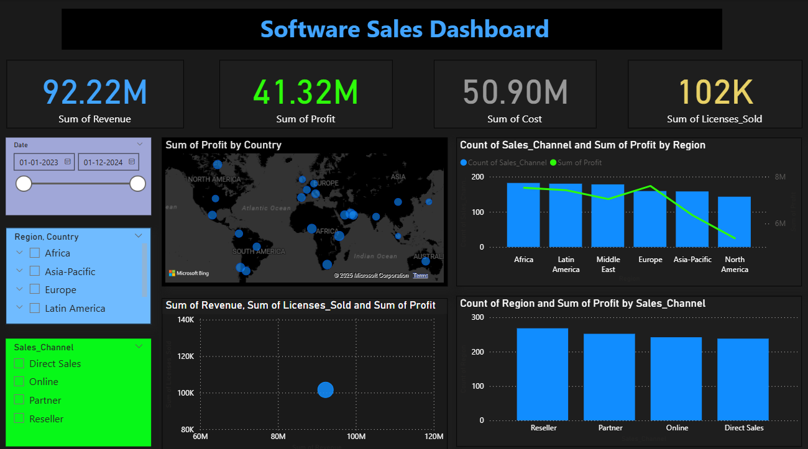

# 📊 Software Sales Dashboard (Power BI)

A fully interactive **Power BI Dashboard** built to analyze **global software sales performance** across regions, countries, and sales channels.  
This dashboard provides business-ready insights using KPIs, maps, bar charts, and advanced slicers.

---

## 🖼️ Dashboard Preview

---

## 🚀 Project Overview

This dashboard is designed to help business users quickly understand:

- Total Revenue  
- Total Profit  
- Total Cost  
- Licenses Sold  
- Profit distribution by country  
- Region-wise performance  
- Sales channel insights  

The report uses dynamic filtering for deeper analysis.

---

## 🔍 Dashboard Features

### ✅ **KPI Cards**
- **Revenue:** 92.22M  
- **Profit:** 41.32M  
- **Cost:** 50.90M  
- **Licenses Sold:** 102K  

These provide an instant snapshot of business performance.

---

### 🌍 **Profit by Country (Map Visual)**
Displays profit distribution globally using bubble sizes mapped to each country.

---

### 📈 **Sales Channel & Region Insights**
- Bar + Line Combined Visual
- Shows count of Sales Channels by region
- Line represents profit trend

---

### 🟦 **Revenue vs Licenses Sold vs Profit (Bubble Chart)**
Multivariate bubble chart comparing 3 metrics at once.

---

### 🧱 **Sales Channel Performance (Bar Chart)**
Compares:
- Direct Sales  
- Online  
- Partner  
- Reseller  

---

### 🎛️ **Interactive Slicers**
Includes slicers for:
- **Date Range**
- **Region / Country**
- **Sales Channel**

Allows fully dynamic filtering.

---

## 🛠 Tools & Technologies

| Tool | Usage |
|------|-------|
| **Power BI Desktop** | Dashboard creation |
| **Power Query** | Cleaning & transformation |
| **DAX** | Calculated measures |
| **Microsoft Bing Maps** | Country visualization |

---

## 📂 Project Contents

📁 Software-Sales-Dashboard

│── SOFTWARE SALES DASHBOARD.pbix

│── SOFTWARE SALES DASHBOARD.png

│── README.md

└── dataset.csv 

## 🎯 Key Insights

- Europe and Asia-Pacific generate strong profit margins  
- Reseller and Partner channels perform consistently well  
- Country-level profit reveals major market differences  
- Licenses sold strongly correlate with revenue growth  

---

## 📥 How to Use

1. Clone or download this repository  
2. Open the **.pbix** file in **Power BI Desktop**  
3. Load the dataset if the report prompts  
4. Interact with slicers to explore insights  

---

## 🔮 Future Enhancements

- Add forecasting for revenue & profit  
- Include drill-through for product-level details  
- Introduce AI visuals (Key Influencers)  
- Add What-If parameters for scenario analysis  

